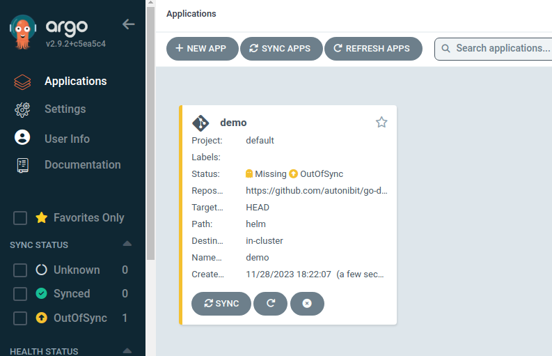
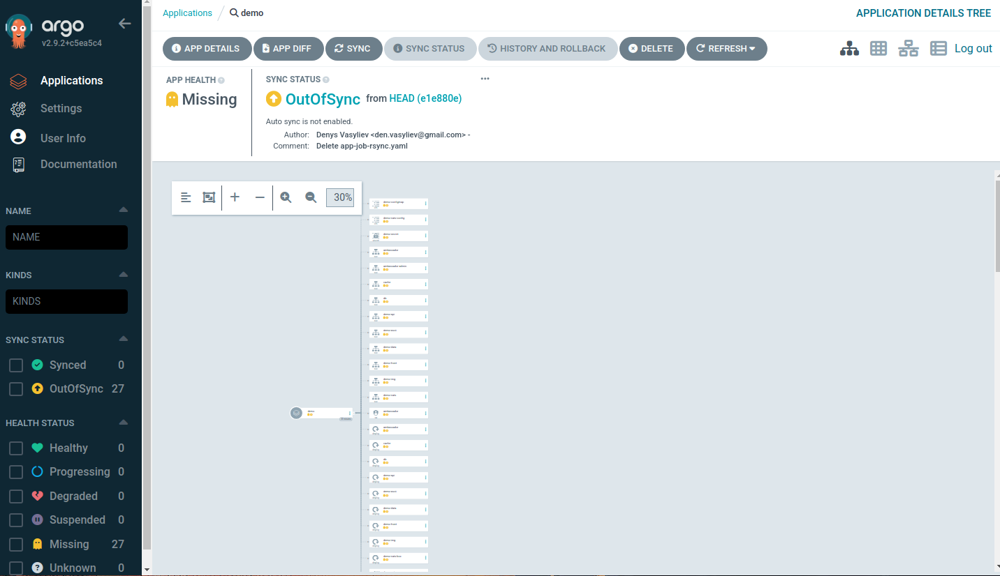
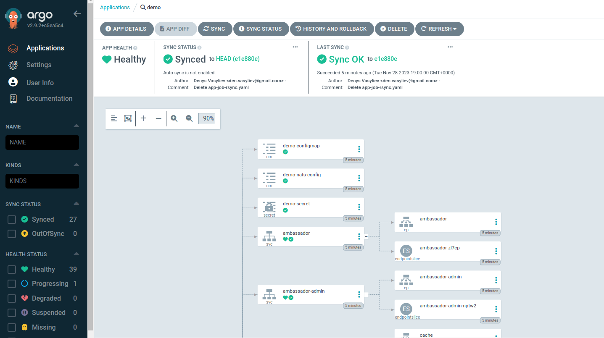
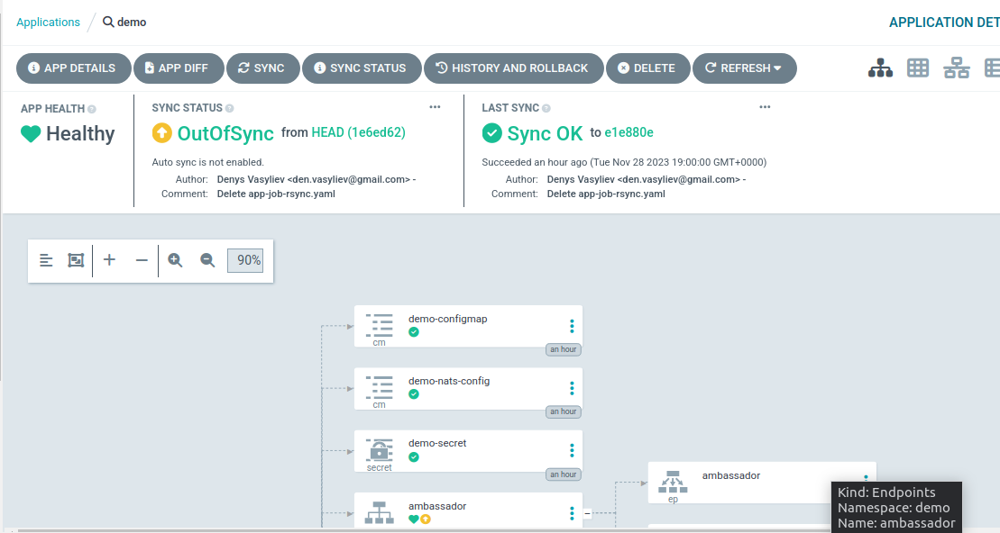
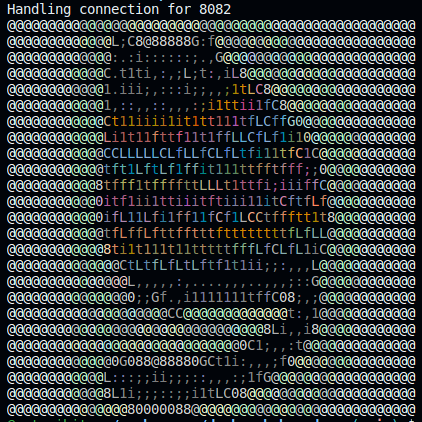

# AsciiArtify. Minimum Viable Product

> Налаштовуємо застосунок, який буде автоматично розгортатися в Kubernetes

1. В панелі AgroCD натискаємо `+ NEW APP`
2. У модальному вікні, що відкрилося, заповнюємо поля:

   - **Applicaton Name:** назва застосунку
   - **Project Name:** default
   - **AUTO-CREATE NAMESPACE:** ✓
   - **Repository URL:** посилання на репозиторій, що містить маніфести для розгортання
   - **Revision:** HEAD
   - **Path:** helm
   - **Cluster URL:** [https://kubernetes.default.svc](https://kubernetes.default.svc/)
   - **Namespace:** demo
3. Натискаємо `CREATE`

   В результаті на панелі відобразиться доданий застосунок:

   

4. Переглянемо деталі застосунку, натиснувши на блок **Demo.**

   

5. AgroCD аплікейш створено, але поки не розгорнуто. Розгорнемо ж його, здійснивши першу синхронізацію, натиснувши кнопку `Sync` та обравши в данному випадку всі компоненти зі списку.

   

   Згодом статуси зміняться на **Healthy**, **Syned**, **Sync OK**, це означатиме, що проект повністю розгорнуто, а стан вихідного коду відповідає стану в репозиторії.
6. Як кільки стан проекту в репозиторії зміниться, AgroCD помітить різницю і повідомить, що застосунок не синхронізовано.

   Далі треба або знову натиснути кнопку синхронізації або налаштувати автоматичну синхронізацію. Перевіремо це, відредагувавши в репозиторії файл `helm/values.yaml`, виправивши для api-gateway type на `LoadBalancer`. Ось так:

   ```bash
   api-gateway:
     image:
       tag: 0.51.2
     service:
       type: LoadBalancer
   ```
   Натиснемо кнопку `Refresh` і побачимо повідомлення **OutOfSync**, тобто AgroCD відслідкував зміни в репозиторії:

   

   Якщо знову здійснити синхронізацію, то стан кластеру оновиться відповідно до останніх змін в репозиторії.
3. Перевіремо роботу застосунку.

   - Повернемо значення `NodePort` та впевнемося що все синхронізовано.
   - Зробимо порт-форвардінг для `ambassador`

     ```bash
     kubectl port-forward -n demo svc/ambassador 8082:80&
     ```
   - Перевіремо доступ

     ```bash
     curl localhost:8082
     ```
   - Завантажемо зображення (попередньо зображення має бути збережено в системі, в якій запущено кластер)

     ```bash
     curl -F 'image=@img.jpg' localhost:8082/img/
     ```
     Програма трансформує зображення у ASCII арт.

     Оригінал:

     

     Результат:

     

   Демонстрація кроків:

   [](https://asciinema.org/a/wgiRhDrYWRGY0DlwWIdiUXJCF)
